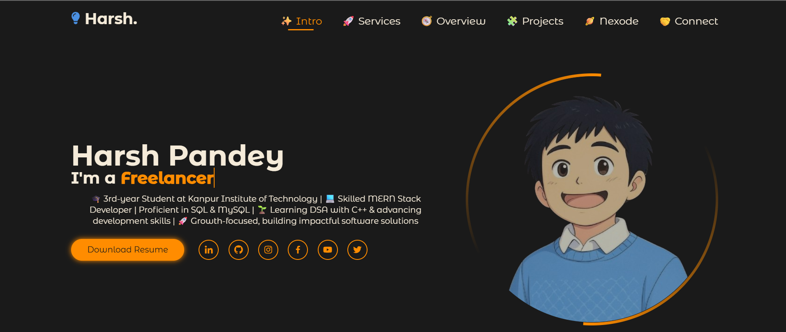
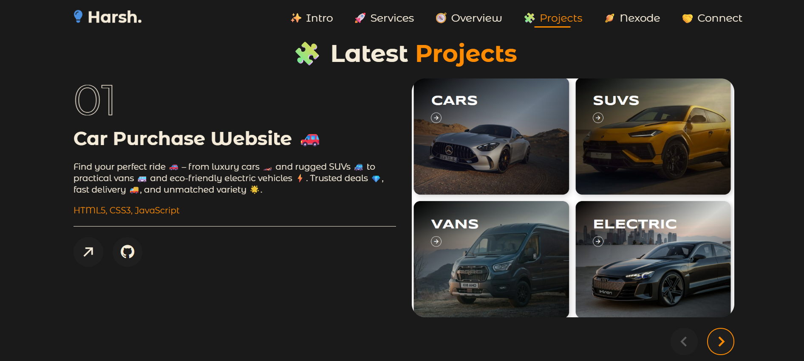
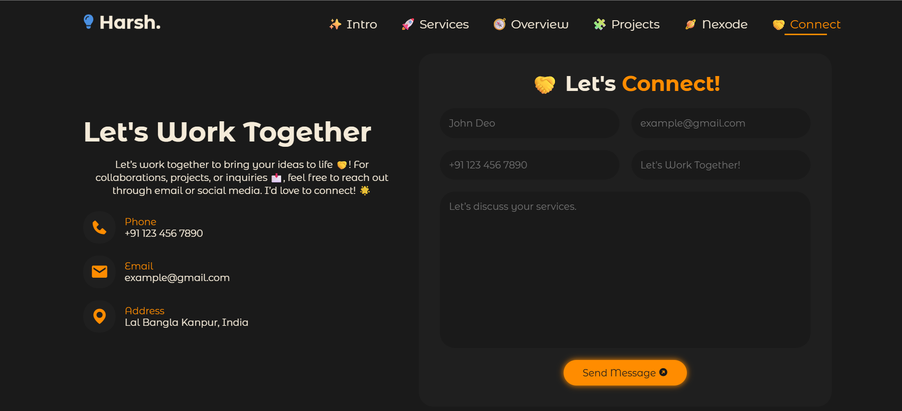

# 🚀 My Portfolio Website

Welcome to my personal portfolio! Here, you’ll find my projects, skills, and experience as a passionate developer and problem solver. 💻✨

---

## 👨‍💻 About Me

I’m a developer who loves building scalable and beautiful web applications using modern technologies. Always eager to learn and innovate! 🌟

---

## 🖼️ Screenshots

### Home Page

_This is the main landing page of my portfolio._

### Projects Section

_Showcasing all my key projects with interactive cards._

### Contact Section

_Users can reach out via the contact form._

---

## 🛠️ Skills

- **Programming Languages:**

  - C++ 🖥️
  - Java ☕
  - JavaScript 📜
  - HTML5 🌐
  - CSS3 🎨

- **Frontend:**

  - ReactJS ⚛️
  - TailwindCSS 💨

- **Backend:**

  - NodeJS 🟢
  - ExpressJS 🚂

- **Databases:**
  - MongoDB 🍃
  - MySQL 🐬

---

## ⚡ Features

- Responsive & modern UI design 📱💻
- Interactive components powered by ReactJS ⚛️
- Backend APIs built with NodeJS & ExpressJS 🛠️
- Database integration with MongoDB & MySQL 🗄️
- Styled with TailwindCSS for sleek design 🎨

---

## 🔗 Live Preview

Check out my portfolio website live here:  
(https://portfoliotechy.netlify.app/)
