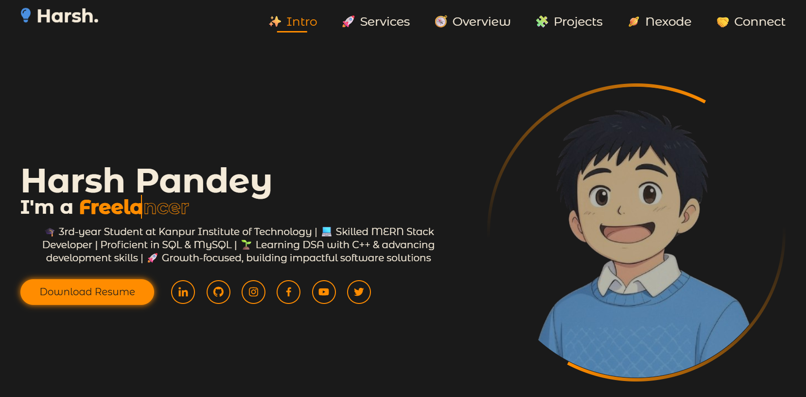

# 🚀 My Portfolio Website

Welcome to my personal portfolio! Here, you’ll find my projects, skills, and experience as a passionate developer and problem solver. 💻✨

## 👨‍💻 About Me  
I’m a developer who loves building scalable and beautiful web applications using modern technologies. Always eager to learn and innovate! 🌟

---

## 🛠️ Skills

- **Programming Languages:**  
  - C++ 🖥️  
  - Java ☕  
  - JavaScript 📜  
  - HTML5 🌐  
  - CSS3 🎨  

- **Frontend:**  
  - ReactJS ⚛️  
  - TailwindCSS 💨  

- **Backend:**  
  - NodeJS 🟢  
  - ExpressJS 🚂  

- **Databases:**  
  - MongoDB 🍃  
  - MySQL 🐬  

---

## ⚡ Features
- Responsive & modern UI design 📱💻  
- Interactive components powered by ReactJS ⚛️  
- Backend APIs built with NodeJS & ExpressJS 🛠️  
- Database integration with MongoDB & MySQL 🗄️  
- Styled with TailwindCSS for sleek design 🎨  

---

## 🔗 Live Preview

Check out my portfolio website live here:  
(https://portfoliotechy.netlify.app/)