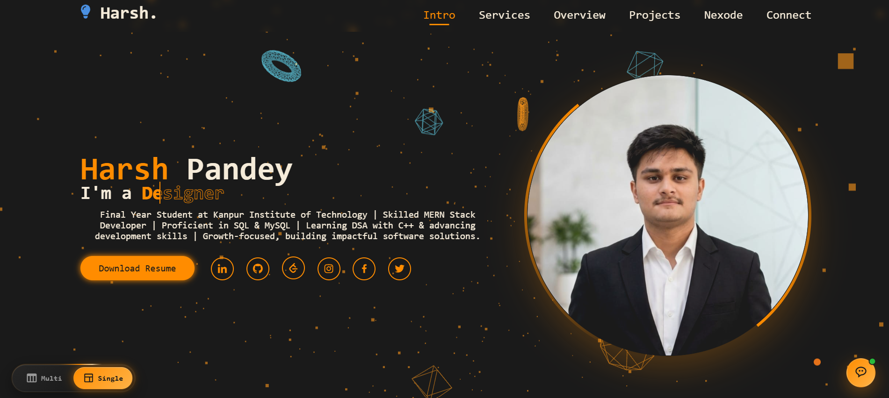
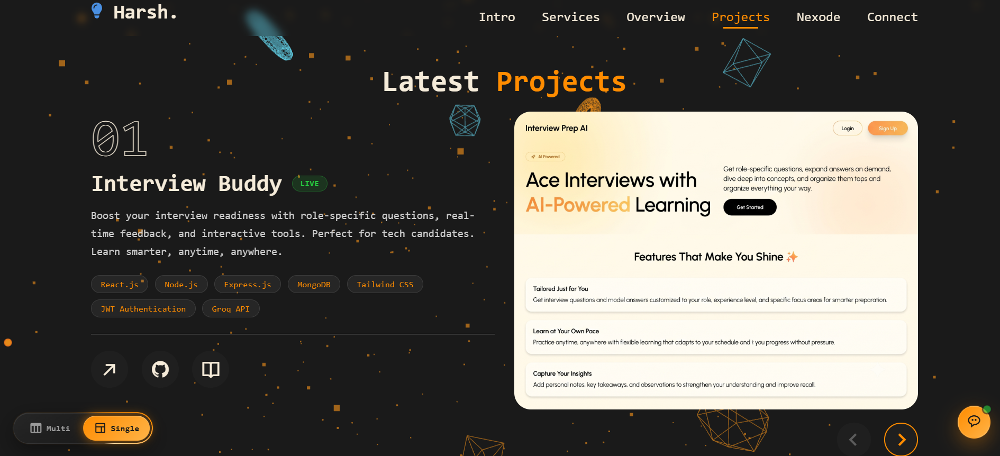
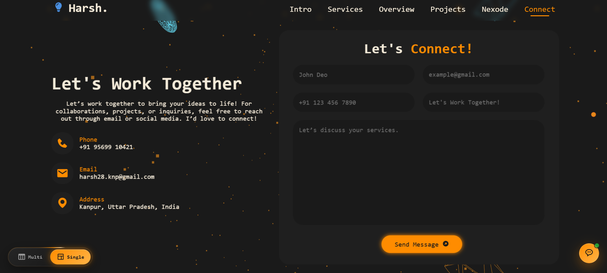

<div align="center">

# 🚀 Harsh Pandey — Developer Portfolio

[](https://portfoliotechy.netlify.app/)
[](https://www.linkedin.com/in/harsh28pandey/)
[](https://github.com/Harsh28Pandey)
[](https://www.leetcode.com/harsh28pandey)

*Final Year Student @ Kanpur Institute of Technology | MERN Stack Developer | DSA with C++*

</div>

---

## 👨‍💻 About Me

I'm **Harsh Pandey**, a passionate full-stack developer and problem solver from Kanpur, Uttar Pradesh, India. I love building **scalable, performant, and visually stunning** web applications using modern technologies.

- 🎓 Final Year B.Tech student at **Kanpur Institute of Technology**
- 💻 Skilled in **MERN Stack** (MongoDB, Express, React, Node)
- 🧮 Learning **DSA with C++** and advancing algorithmic thinking
- 🌱 Growth-focused — always building, always shipping

---

## 🖼️ Screenshots

| Home Page | Projects Section | Contact Section |
|:---------:|:----------------:|:---------------:|
|  |  |  |
| *Animated intro with 3D background* | *Interactive project cards* | *Connect form with EmailJS* |

---

## ✨ Features

| Feature | Description |
|--------|-------------|
| 🎨 **3D Animated Background** | Powered by Three.js for an immersive visual experience |
| ⚡ **GSAP Animations** | Scroll-triggered animations and smooth transitions throughout |
| 🤖 **AI Chatbot** | Groq LLM-powered assistant (desktop only) built into the portfolio |
| 🖥️ **Hidden Terminal** | Easter egg terminal UI — type `help` to explore commands |
| 📱 **Fully Responsive** | Mobile-first design, works beautifully on all screen sizes |
| 🌀 **3D Loader** | Custom Three.js 3D badge loader with animated progress |
| 🧲 **Magnetic Buttons** | Smooth magnetic hover effects on interactive elements |
| 🗂️ **Case Study Modal** | Deep-dive project breakdowns via interactive modal |
| 📧 **Contact Form** | EmailJS-powered contact form with validation |
| 🎮 **Tilt 3D Cards** | Interactive 3D tilt effect on project and tech cards |

---

## 🛠️ Tech Stack

### 💻 Languages


### 🎨 Frontend


### 🔧 Backend


### 🗄️ Databases


### 🧰 Tools & Libraries


---

## 📁 Project Structure

```
portfolio/
├── index.html          # Main HTML entry point
├── style.css           # Core styles
├── chatbot.css         # AI chatbot styles (desktop)
├── case-studies.css    # Case study modal styles
├── single-page.css     # Single page navigation styles
├── scroll-fx.css       # Scroll animation styles
├── script.js           # Core site logic
├── loader.js           # Page loader animation
├── loader3d.js         # Three.js 3D badge loader
├── three-bg.js         # Three.js animated background
├── tilt-3d.js          # 3D tilt card effect
├── magnetic-btn.js     # Magnetic button hover effect
├── nav3d.js            # 3D navigation animations
├── section-fx.js       # Section entrance animations
├── single-page.js      # Single-page navigation logic
├── scroll-fx.js        # GSAP ScrollTrigger effects
├── command_palette.js  # Command palette (Easter egg)
├── contact.js          # EmailJS contact form handler
├── case-studies.js     # Case study modal content
├── chatbot.js          # Groq LLM chatbot (desktop)
├── config.js           # API config (git-ignored 🔒)
└── images/             # Assets and screenshots
```

---

## 🌐 Sections

- **Intro** — Animated hero with 3D background, name reveal & role typewriter
- **Services** — What I offer as a developer & freelancer
- **Overview** — Skills, experience & tech overview
- **Projects** — Interactive project cards with case study deep-dives
- **Nexode** — Learning resources & CSS/JS game recommendations
- **Connect** — Contact form + social links

---

## 📬 Contact

| Platform | Link |
|---------|------|
| 📧 Email | harsh28.knp@gmail.com |
| 📞 Phone | +91 95699 10421 |
| 📍 Location | Kanpur, Uttar Pradesh, India |
| 💼 LinkedIn | [harsh28pandey](https://www.linkedin.com/in/harsh28pandey/) |
| 🐦 Twitter/X | [@pandey28harsh](https://www.x.com/pandey28harsh) |
| 📸 Instagram | [@pandey28harsh](https://www.instagram.com/pandey28harsh) |

---

<div align="center">

Made with ❤️ by **Harsh Pandey**

⭐ *If you like this portfolio, consider giving it a star!*

</div>